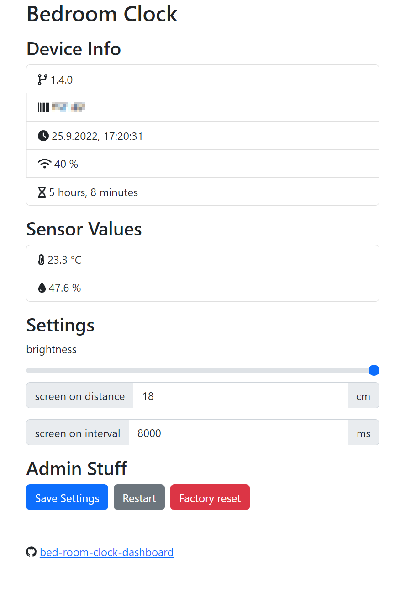

# bedroom-clock-dashboard

## Description

It's the dashboard for the [Bed-Room Clock](https://github.com/coding-lemur/bed-room-clock).



## FAQ

### Why the dashbaord isn't hosted on the ESP32 directly?

It hosted external (on Github Pages) because on the ESP32 isn't enough space to store all static files for the dashboard. So the ESP32 webserver tunneling all specific request to the Github Pages URL and only execute API requsts internal.

### Can I selfhost the Dashboard locally?

Yes, it is possible to run the dashboard from your own server.

You have to build the project with the command

```bash
npm run build
```

and copy the content of the `dist` folder to a public endpoint (maybe a nginx on your server). It's also possible to make a Docker container with the dashboard.

Now you have to change some URLs in the [bedroom-clock firmware](https://github.com/coding-lemur/bed-room-clock):

Clone the repo and open `src/main.cpp`.

Change the value of the two variables "externalBaseUrl" and "indexPath" so it matches your own server URL (domain or IP address)

```c++
const char *externalBaseUrl = "http://192.168.178.5";
const char *indexPath = "/folder/index.html";
```

## General project setup

```bash
npm install
```

### Compiles and hot-reloads for development

```bash
npm run serve
```

### Compiles and minifies for production

```bash
npm run build
```

### Lints and fixes files

```bash
npm run lint
```

### Customize configuration

See [Configuration Reference](https://cli.vuejs.org/config/).
